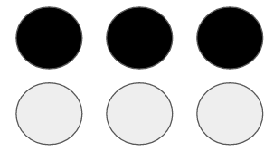

Telluride2021-BrailleLetter-NUSkin
====================================

Braille is a tactile writing system used by people who are visually impaired. These characters have rectangular blocks called *cells* that have tiny bumps called *raised dots*. The number and arrangement of these dots distinguish one character from another. For more details and background information see [here](https://en.wikipedia.org/wiki/Braille).

# The Dataset
The dataset is composed of sensor readings upon pressing on 27 braille letters ("space" + A - Z). The data are recorded with NUSkin event-based tactile sensor pressing down 3D printed braille letter stimuli with a constant velocity. The motion is controlled by 7 DOF KUKA iiwa robot arm together with an 6-axis ATI mini45 force sensor. Asynchronous adc values are recorded and are then processed into spike events. Slightly different position offset are applied to 50 samples, so that the relative postion among activated taxels instead of absolute taxel_id matter for the dataset. This ensures that the dataset is rather location-invariant to classify different letters.
 
NUSkin sensor | KUKA robot arm | ATI mini45 sensor
:-----------:|:---------------:|:----------:
 |  | 

Experiment setup  

# Processing Pipeline and DataStructure
1. The raw data are recorded in [rosbag](http://wiki.ros.org/rosbag) and are then trimmed based on timestamp and converted to csv files. 
2. One csv file and one txt file are generated for each sample of each label (27 braille letters). 
3. `sort_df` reads csv files and sorts them based on taxel_id and timestamps. This process facilitates the polarity processing in the next step and resulted data are stored in `data` folder.
4. `preprocess` is the core program for preprocessing. It takes csv files as input, binarizes/smoothens the spikes, and provides an example of visualize the resulting event as animation. For each sample, it can generate a numpy array of shape [80, 1, T] where 80 represents 80 taxels, 2 represents 2 polarity channels, and T represents the number of time bins and can be tuned in `preprocess`

# Sample result

*Note: the letter image is rotated by 90 degrees but has no harm on data processing and learning*
Letter | Braille image | animated spike
:-----------:|:---------------:|:----------:
A |  | 
G |  | 
L |  | 

